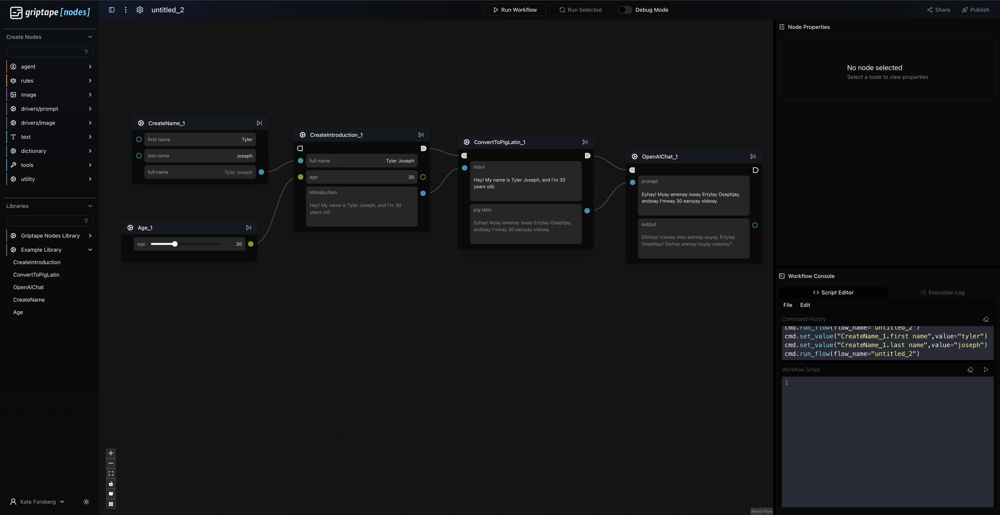

# Griptape Nodes: Node Library Template

Hi! Welcome to Griptape Nodes. 
This is a guide to write your own nodes and node library, in order to use in our [Griptape Nodes](https://www.griptapenodes.com/) platform. 

## Use this Template
Create your own repository using this GitHub Template. Use the Template button in the top right. 

Once you've created your own repository from this template, you need to pull it down to your local machine, or the machine where you are running your Griptape Nodes Engine. 

> **Hint**: It's recommended to clone this repository into your Griptape Nodes workspace directory. You can find your workspace directory by running:
> ```bash
> gtn config show workspace_directory
> ```
> Here's a quick way to navigate to your workspace directory:
> ```bash
> cd `gtn config show workspace_directory`
> ```
> Finally, clone the repository:
> ```bash
> git clone https://github.com/{{ .RepoName }}.git
> ```

## 🏗️ Setup Your Library

To create your node library and make it importable by other users, please follow the steps below.

1. rename `example_nodes_template` to the name of your library.
2. Update the `pyproject.toml`:
    ```
    [project]
    name = "<your-library-name>"
    version = "0.1.0"
    description = "<your-description>"
    authors = [
        {name = "<Your-Name>",email = "<you@example.com>"}
    ]
    ```

Next, we'll create the nodes that will live in your library.

Each node is it's own python file, written in pure python code!

To create nodes for your library, please take a look at our provided examples in the `example_nodes_template` library and follow the steps below.

**Example Nodes:**

- [Age Node (DataNode)](example_nodes_template/age_node.py) - Simple data processing node with numeric input
- [Create Introduction (ControlNode)](example_nodes_template/create_introduction.py) - Control flow node for text processing  
- [Create Name Node](example_nodes_template/create_name.py) - Basic string manipulation node
- [OpenAI Chat (ControlNode with Dependencies)](example_nodes_template/openai_chat.py) - Advanced node with external API integration
- [Pig Latin -Converter](example_nodes_template/pig_latin.py) - Text transformation example


## 📝 Creating Your Nodes

### Define a file with your node name
Define a `<your-node-name>.py` file in your `<your-library-name>` directory. 

### Define the Node Class
There are two different types of Nodes that you could choose to define.

1. **ControlNode**
    Has Parameters that allow for configuring a control flow. They create the main path of the flow upon run. 
2. **DataNode**
    Solely has parameters that define and create data values. They can be dependencies of nodes on the main flow, but don't have control inputs/outputs.
    *You can add ControlParameters to a DataNode if desired to give it the functionality of a ControlNode.*

Within your `<your-node-name>.py`.
Add this import at the top of your file and define your Node or Nodes as a class. 

```
from griptape_nodes.exe_types.node_types import ControlNode, DataNode
from griptape_nodes.exe_types.core_types import Parameter

# Creating a Control Node
class <YourNodeName>(ControlNode):
    pass

# Creating a Data Node
class <YourNodeName>(DataNode):
    pass
```

### Initialize your Node and define your Parameters

Parameters are fields on the node that can be connected to other nodes or set by the user. 
Parameters have many fields that can be configured for their desired behavior. 
Only a couple of the fields are mandatory. The rest are optional.

### Parameter Fields 
1. name: `str` The name of the parameter. Must be unique to the node.
2. tooltip: `str | list[dict]` The description that will appear upon hovering the mouse.
3. type: `str` *OPTIONAL* The type of the value in the parameter. If not defined, it will be whatever the python type is.
4. input_types: `list[str]` *OPTIONAL* The allowed list of types that can be connected as an INPUT to your parameter.
5. output_type: `str` *OPTIONAL* The type that the OUTPUT of your parameter will be.
6. default_value: Any *OPTIONAL* A default value for your parameter if it isn't set
7. tooltip_as_input: `str | list[dict]` *OPTIONAL* Tooltip on the input port
8. tooltip_as_property: `str | list[dict]` *OPTIONAL* Tooltip on the property displapy
9. tooltip_as_output: `str | list[dict]` *OPTIONAL* Tooltip on the output port
10. allowed_modes: `set[ParameterMode]` 
    *OPTIONAL* The allowed modes. 
    `ParameterMode.INPUT`: Accepts inputs 
    `ParameterMode.OUTPUT`: Sends output
    `ParameterMode.PROPERTY`: Can be set on the node itself. 
11. ui_options: `dict`  *OPTIONAL* Informs the display of your node.
12. traits: `set[type[Trait] | Trait]` *OPTIONAL* Reusable classes that define features on a parameter, including converters and UI options. They are inheritable!
13. converters: `list[Callable[[Any], Any]]` *OPTIONAL* Modifies the parameter value after being set if needed.
14. validators: `list[Callable[[Parameter, Any], None]]` *OPTIONAL* Validates that the value on the parameter is correct.

### Define Node Method

Nodes have one absolute method that *absolutely* (haha) must be defined.
This is the method that is called by the node at runtime when a node executes. 
It completes the function of your node, whether thats creating a string, generating an image, or creating an agent.
```
def process(self) -> None:
    pass
```
### Additional Optional Methods
Nodes have additional methods that can provide functionality at or before runtime (and you can define as many helper functions as you'd like.)
1. Validate Node
``` 
def validate_node(self) -> list[Exception] | None:
        """Method called to check that all dependencies, like API keys or models, exist in the environment before running the workflow. 
        The default behavior is to return None. Custom Nodes that have dependencies will overwrite this method in order to return exceptions if the environment isn't set.
        For example, a node that uses an OpenAI API Key will check that it is set in the environment and that the key is valid. 

        Returns:
            A list of exceptions if any arise, or None. The user can define their own custom exceptions, or use provided python exceptions. 
        """
```
2. Before setting a value on a parameter
```
def before_value_set(self, parameter: Parameter, value: Any) -> Any:
    """Callback when a Parameter's value is ABOUT to be set.

        Custom nodes may elect to override the default behavior by implementing this function in their node code.

        This gives the node an opportunity to perform custom logic before a parameter is set. This may result in:
        * Further mutating the value that would be assigned to the Parameter
        * Mutating other Parameters or state within the Node

        If other Parameters are changed, the engine needs a list of which
        ones have changed to cascade unresolved state.

        Args:
            parameter: the Parameter on this node that is about to be changed
            value: the value intended to be set (this has already gone through any converters and validators on the Parameter)

        Returns:
            The final value to set for the Parameter. This gives the Node logic one last opportunity to mutate the value
            before it is assigned.
        """
```
3. After setting a value on a parameter
```
def after_value_set(self, parameter: Parameter, value: Any) -> None: 
        """Callback AFTER a Parameter's value was set.

        Custom nodes may elect to override the default behavior by implementing this function in their node code.

        This gives the node an opportunity to perform custom logic after a parameter is set. This may result in
        changing other Parameters on the node. If other Parameters are changed, the engine needs a list of which
        ones have changed to cascade unresolved state.

        Args:
            parameter: the Parameter on this node that was just changed
            value: the value that was set (already converted, validated, and possibly mutated by the node code)

        Returns:
            Nothing
        """
```
4. Checking if a connections to the node are allowed. 
The default value is true, but Custom nodes can implement this method however they'd like to control connections.
```
def allow_incoming_connection(
        self,
        source_node: Self,
        source_parameter: Parameter, 
        target_parameter: Parameter, 
    ) -> bool:
        """Callback to confirm allowing a Connection coming TO this Node.
        """
        return True
```
```
def allow_outgoing_connection(
        self,
        source_parameter: Parameter,  # noqa: ARG002
        target_node: Self,  # noqa: ARG002
        target_parameter: Parameter,  # noqa: ARG002
    ) -> bool:
        """Callback to confirm allowing a Connection going OUT of this Node."""
        return True
```
5. Callbacks AFTER creating or removing a connection
```
def after_incoming_connection(
        self,
        source_node: Self,  # noqa: ARG002
        source_parameter: Parameter,  # noqa: ARG002
        target_parameter: Parameter,  # noqa: ARG002
    ) -> None:
        """Callback after a Connection has been established TO this Node."""
        return
```
```
def after_outgoing_connection(
        self,
        source_parameter: Parameter,  # noqa: ARG002
        target_node: Self,  # noqa: ARG002
        target_parameter: Parameter,  # noqa: ARG002
    ) -> None:
        """Callback after a Connection has been established OUT of this Node."""
        return

```
```
def after_incoming_connection_removed(
        self,
        source_node: Self,  # noqa: ARG002
        source_parameter: Parameter,  # noqa: ARG002
        target_parameter: Parameter,  # noqa: ARG002
    ) -> None:
        """Callback after a Connection TO this Node was REMOVED."""
        return
```
```
def after_outgoing_connection_removed(
        self,
        source_parameter: Parameter,  # noqa: ARG002
        target_node: Self,  # noqa: ARG002
        target_parameter: Parameter,  # noqa: ARG002
    ) -> None:
        """Callback after a Connection OUT of this Node was REMOVED."""
        return
```


## 📋 Library Configuration

### Create your library JSON file
This configuration file defines your library metadata, dependencies, and nodes. It will be loaded by the Griptape Nodes engine at runtime.

```
{
    "name": "<Your-Library-Name>",
    "library_schema_version": "0.3.0",
    "metadata": {
        "author": "<Your-Name>",
        "description": "<Your Description>",
        "library_version": "0.1.0",
        "engine_version": "0.60.0",
        "tags": [
            "Griptape",
            "AI",
            "<Your-Category>"
        ],
        "dependencies": {
            "pip_dependencies": [
                // Add any Python packages your nodes require
                // "requests>=2.25.0",
                // "pillow>=8.0.0"
            ]
        }
    },
    "settings": [
        {
            "description": "API keys required by nodes in this library",
            "category": "app_events.on_app_initialization_complete",
            "contents": {
                "secrets_to_register": [
                    // Add any API keys your nodes need
                    // "YOUR_API_KEY"
                ]
            }
        }
    ],
    "categories": [
        {
            "<your-category-id>": {
                "color": "border-blue-500",
                "title": "<Your Category>",
                "description": "<Category Description>",
                "icon": "Folder"
            }
        }
    ],
    "nodes": [
        {
            "class_name": "<YourNodeName>",
            "file_path": "<your-library-name>/<your-node-name>.py",
            "metadata": {
                "category": "<your-category-id>",
                "description": "<Node Description>",
                "display_name": "<Your Node Display Name>"
            }
        }
    ]
}
```

### Key Configuration Features

#### Dependencies
Add Python packages your nodes require in the `dependencies.pip_dependencies` array. The engine will automatically install these when loading your library.

#### Secrets Management
Use the `settings.secrets_to_register` array to automatically register API keys and secrets your nodes need. Users will be prompted to configure these in the Griptape Nodes settings.

#### Categories
Organize your nodes into logical categories with custom colors and icons. Use descriptive category IDs like `"image/processing"` or `"data/conversion"`.

## 🛠️ Best Practices

### Error Handling
Always implement proper error handling in your nodes:

```python
def process(self) -> None:
    try:
        # Your node logic here
        result = self.do_something()
        self.set_parameter_value("output", result)
    except Exception as e:
        # Log the error and provide helpful feedback
        logger.error(f"Node failed: {str(e)}")
        raise RuntimeError(f"Processing failed: {str(e)}")
```

### Logging
Use the standard Python logging module for debugging:

```python
import logging

logger = logging.getLogger(__name__)

def process(self) -> None:
    logger.debug("Starting processing...")
    # Your logic here
    logger.info("Processing completed successfully")
```

### Input Validation
Validate inputs before processing:

```python
def validate_before_node_run(self) -> list[Exception] | None:
    errors = []
    
    # Check required parameters
    if not self.get_parameter_value("required_param"):
        errors.append(ValueError("Required parameter is missing"))
    
    # Check API keys
    if not os.getenv("YOUR_API_KEY"):
        errors.append(ValueError("YOUR_API_KEY environment variable not set"))
    
    return errors if errors else None
```

### Modern Parameter Patterns
Use traits and modern parameter features:

```python
from griptape_nodes.traits.file_system_picker import FileSystemPicker
from griptape_nodes.traits.options import Options
from griptape_nodes.traits.slider import Slider

# File picker parameter
Parameter(
    name="input_file",
    type="str",
    tooltip="Select input file",
    traits={FileSystemPicker(allow_files=True, file_types=[".txt", ".json"])}
)

# Dropdown options
Parameter(
    name="model_type",
    type="str",
    default_value="gpt-4",
    tooltip="Select model type",
    traits={Options(choices=["gpt-4", "gpt-3.5-turbo", "claude-3"])}
)

# Slider for numeric values
Parameter(
    name="temperature",
    type="float",
    default_value=0.7,
    tooltip="Creativity level (0.0-2.0)",
    traits={Slider(min_val=0.0, max_val=2.0)}
)
```

### Secrets Management
Use the SecretsManager for API keys:

```python
from griptape_nodes.retained_mode.griptape_nodes import GriptapeNodes

class MyNode(DataNode):
    API_KEY_NAME = "MY_SERVICE_API_KEY"
    
    def _validate_api_key(self) -> str:
        api_key = GriptapeNodes.SecretsManager().get_secret(self.API_KEY_NAME)
        if not api_key:
            raise ValueError(f"Missing {self.API_KEY_NAME}")
        return api_key
```

### Import Best Practices
Always import dependencies at module level:

```python
# ✅ Good - Module level imports
from PIL import Image
from io import BytesIO
import requests

# ❌ Bad - Lazy imports inside functions
def process(self):
    from PIL import Image  # Don't do this
```

### Dynamic Parameter Visibility
Create context-aware UIs:

```python
def after_value_set(self, parameter: Parameter, value: Any) -> None:
    if parameter.name == "mode":
        if value == "advanced":
            self.show_parameter_by_name("advanced_options")
        else:
            self.hide_parameter_by_name("advanced_options")
    return super().after_value_set(parameter, value)
```

### Success/Failure Node Pattern
For operations that can fail, use SuccessFailureNode:

```python
from griptape_nodes.exe_types.node_types import SuccessFailureNode

class MyProcessingNode(SuccessFailureNode):
    def __init__(self, **kwargs) -> None:
        super().__init__(**kwargs)
        
        # Add status parameters
        self._create_status_parameters(
            result_details_tooltip="Details about the operation result",
            result_details_placeholder="Operation details will appear here.",
        )
    
    def process(self) -> None:
        self._clear_execution_status()
        
        try:
            # Your processing logic
            result = self.do_processing()
            self.parameter_output_values["output"] = result
            
            # Success
            self._set_status_results(
                was_successful=True, 
                result_details="SUCCESS: Operation completed"
            )
        except Exception as e:
            # Failure
            self._set_status_results(
                was_successful=False, 
                result_details=f"FAILURE: {str(e)}"
            )
            self._handle_failure_exception(e)
```

### Asynchronous Processing
For long-running operations, use the async pattern:

```python
from griptape_nodes.exe_types.node_types import AsyncResult

class MyAsyncNode(DataNode):
    def process(self) -> AsyncResult[None]:
        yield lambda: self._process()
    
    def _process(self) -> None:
        # Long-running operation
        result = self.perform_long_operation()
        self.parameter_output_values["output"] = result
```

### ParameterList for Multiple Inputs
Accept multiple inputs of the same type:

```python
from griptape_nodes.exe_types.core_types import ParameterList

self.add_parameter(
    ParameterList(
        name="images",
        input_types=["ImageArtifact", "ImageUrlArtifact", "list[ImageArtifact]"],
        default_value=[],
        tooltip="Multiple image inputs",
        allowed_modes={ParameterMode.INPUT},
    )
)

# In process method
images = self.get_parameter_list_value("images")  # Always returns list
```

## 📦 Installation

### Prerequisites

- [Griptape Nodes](https://github.com/griptape-ai/griptape-nodes) installed and running
- Your custom node library created following the steps above

### Install the Library

1. **Download the library files** to your Griptape Nodes libraries directory:
   ```bash
   # Navigate to your Griptape Nodes libraries directory
   cd `gtn config show workspace_directory`
   
   # Clone or download your library
   git clone https://github.com/your-username/your-library-name.git
   ```

2. **Add the library** in the Griptape Nodes Editor:
   * Open the Settings menu and navigate to the *Libraries* settings
   * Click on *+ Add Library* at the bottom of the settings panel
   * Enter the path to the library JSON file: **your Griptape Nodes Workspace directory**`/your-library-name/your-library-name.json`
   * You can check your workspace directory with `gtn config show workspace_directory`
   * Close the Settings Panel
   * Click on *Refresh Libraries*

3. **Verify installation** by checking that your custom nodes appear in the Griptape Nodes interface in your defined category.


## 🎯 Example Usage

### Here is an example flow that you could make with the provided nodes:


## 🔍 Troubleshooting

### Common Issues

#### Library Not Appearing
- Verify the JSON file path is correct
- Check that the JSON syntax is valid (no trailing commas, proper quotes)
- Ensure the library was refreshed after adding

#### Node Import Errors
- Check that all required dependencies are listed in the JSON
- Verify Python file paths are correct relative to the JSON file
- Ensure class names match exactly between Python files and JSON

#### Missing API Keys
- Configure secrets in Settings > API Keys & Secrets
- Use the exact key names specified in `secrets_to_register`
- Restart Griptape Nodes after adding new secrets

## 📚 Additional Resources

### Documentation
- [Griptape Nodes Documentation](https://github.com/griptape-ai/griptape-nodes)
- [Griptape Framework](https://github.com/griptape-ai/griptape)
- [Node Development Examples](example_nodes_template/)

### Community
- [Griptape Discord](https://discord.gg/griptape)
- [GitHub Discussions](https://github.com/griptape-ai/griptape-nodes/discussions)

### Example Libraries
- [Griptape Nodes Directory](https://github.com/griptape-ai/griptape-nodes-directory)

## 📄 License

This template is provided under the Apache License 2.0. Your custom library can use any license you choose.

---

Happy building! 🚀
